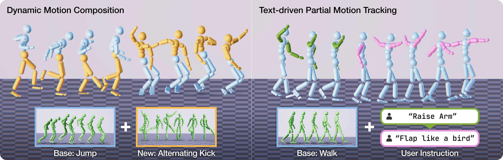

# MaskAdapt: Learning Flexible Motion Adaptation via Mask-Invariant Prior for Physics-Based Characters

Official repository for the CVPR 2026 paper "MaskAdapt: Learning Flexible Motion Adaptation via Mask-Invariant Prior for Physics-Based Characters" by Soomin Park, Eunseong Lee, Kwang Bin Lee, and Sung-Hee Lee. 

Code will be released soon!